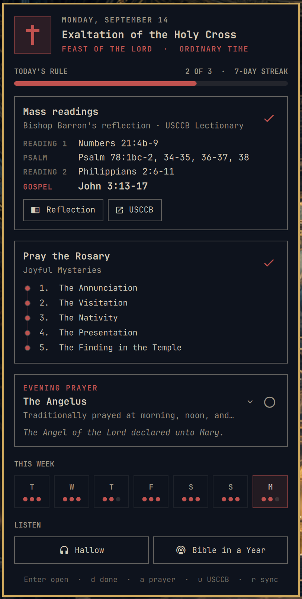

# Ora for Omarchy

Catholic daily prayer in the Omarchy bar: today's feast or saint, the Mass readings, the Rosary, a prayer for the hour, and reminders that keep your rule.

A quiet rule of prayer, one click away.

<p align="center">
  
</p>

Ora puts the liturgical day, the Mass readings, the Rosary, and a prayer for the hour one click away. It uses local state, native Omarchy notifications, and links to trusted providers—no account, no analytics, no bundled copyrighted content.

## Features

- **Today's celebration** from the US Roman calendar: memorials, feasts, and solemnities with their rank and liturgical color (Liturgical Calendar API, cached per year; a built-in season calendar covers offline use)
- **Mass reading citations** for the day, Gospel emphasized, with one-click access to Bishop Barron's Word on Fire reflection and the official USCCB Lectionary text
- **Rosary** mysteries for the weekday, shown as a bead chain
- **Prayer of the hour**: Morning Offering, Angelus (Regina Caeli in Easter), Memorare, and the Act of Contrition, readable in the panel
- **Rule tracking**: mark readings, Rosary, and prayer done; a progress bar, a seven-day strip, and a streak keep you honest
- Reminders for the readings, Angelus, and Rosary, with click-to-open
- Launch links for Hallow and Fr. Mike Schmitz's Bible in a Year
- Optional liturgical tint for the bar cross
- Mouse and keyboard navigation, IPC for scripting

## Install

```bash
omarchy plugin add https://github.com/hmarquez-solutions/omarchy-ora --enable
```

Then add **Ora** to the bar from Omarchy's bar settings. The plugin defaults to the right section.

Nothing is installed outside the plugin folder: no daemon, no service, no
package, no edit to any of your configuration files. Ora needs only what an
Omarchy install already has: the system Python 3, `xdg-open`, and
`omarchy-notification-send` (with `notify-send` as a fallback).

## Remove

```bash
omarchy plugin remove io.github.hmarquez-solutions.ora
```

That deletes the plugin folder. Ora keeps two small directories of its own that
you may delete as well; nothing else on the system is touched:

```bash
rm -rf ~/.cache/omarchy/ora          # cached calendar year and feed citations
rm -rf ~/.local/state/omarchy/ora    # your done/not-done marks, 45 days at most
```

## Controls

- Left click: open Ora
- Right click: open today's Mass readings
- Arrow keys or `j`/`k`: move through the cards
- Enter: open the card (the prayer card expands instead)
- `d` or `x`: mark the highlighted card done or not done
- `m`: open the Word on Fire reflection
- `u`: open the USCCB readings
- `p`: open the Rosary how-to
- `a`: show the prayer of the hour
- `b`: open Bible in a Year
- `r`: sync calendar and readings now
- Escape: close

## IPC

```bash
omarchy-shell ora toggle          # open or close the panel
omarchy-shell ora prayer          # open with the prayer of the hour expanded
omarchy-shell ora readings        # open today's reflection in the browser
omarchy-shell ora rosary
omarchy-shell ora done rosary     # toggle a rule item: readings | rosary | prayer
omarchy-shell ora sync            # refresh the network caches
```

## Settings

- **Color the bar cross by liturgical season** (off by default)
- **Prayer reminders** on/off, with times for the readings, Angelus, and Rosary in 24-hour `HH:MM`

## Data sources and privacy

- Celebrations come from the [Liturgical Calendar API](https://litcal.johnromanodorazio.com/) for the US national calendar, cached for the civil year in `~/.cache/omarchy/ora/`.
- Reading citations and the day's reflection link come from the USCCB and Word on Fire RSS feeds, cached for six hours. Only citations are stored; the Lectionary text stays on USCCB's page.
- Completion state stays in `~/.local/state/omarchy/ora/state.json` and is trimmed to 45 days.
- Ora links to third-party content in the browser; it does not proxy or reproduce it. Hallow is a launch link because it has no public content API.

## Security

Ora runs unsandboxed, like every Omarchy plugin, so it is built to be short and
readable. Each property below names the mechanism and the file.

| Property | Mechanism | Where |
|---|---|---|
| Fixed interpreter, never a `PATH` or `PYTHONPATH` lookup | The helper's shebang is `/usr/bin/python3 -I`, and the panel launches that same interpreter and the helper's own path explicitly. `-I` ignores every `PYTHON*` variable and keeps the script directory off `sys.path`. | `ora`, `Service.qml` |
| The helper never inherits the shell's environment | Every `Process` sets `clearEnvironment` and passes an explicit allowlist: `PATH=/usr/bin:/bin`, locale, `HOME`, the XDG directories, and the display, D-Bus and toolkit variables the browser and the notification call need. `LD_*` and `PYTHON*` never arrive. | `Service.qml` |
| Fixed program paths | `xdg-open`, `omarchy-notification-send` and `notify-send` are called as `/usr/bin/...`, never by bare name. | `ora` |
| Only HTTPS, only listed hosts | Every URL Ora fetches or opens must be `https://` on one of six hosts (the Liturgical Calendar API, `bible.usccb.org`, `www.usccb.org`, `www.wordonfire.org`, `hallow.com`, `app.ascensionpress.com`). Links that arrive in a feed are checked when cached, when read back, and again when opened, so an older or edited cache cannot smuggle one in. A redirect off a listed host is refused. | `ora` (`trusted_url`) |
| Bounded network | Three fixed endpoints, a 10 s timeout each, responses capped at 8 MiB, run only from a background timer or an explicit `r`, never in the click path. Only citations and links are stored; no Lectionary or reflection text. | `ora` |
| Bounded processes | The panel kills a helper that outlives 10 s (actions) or 90 s (sync), and ignores a response over 256 KiB. IPC `done` accepts only the three known kinds. | `Service.qml`, `Panel.qml` |
| No sudo, no pkexec, no services, no installer | Nothing in the tree escalates, installs a unit, adds a package, or writes outside `~/.cache/omarchy/ora` and `~/.local/state/omarchy/ora`. Caches are written to a temp file and renamed into place. | whole tree |
| Reads nothing of yours | Ora never reads your browser, contacts, calendar or any file outside its two directories. Completion marks are trimmed to 45 days so the state file never becomes a diary. | `ora` |

## Development

```bash
./ora today                       # cache-only payload the panel reads
./ora today --sync                # fetch calendar and feeds first
./ora today --date 2026-04-05T12:00
python3 -m unittest discover -s tests -v
```

Clone or symlink this repository into `~/.config/omarchy/plugins/`. The shell watches that directory for changes, but it does not follow symlinks, and it caches compiled QML, so after editing QML run `omarchy-restart-shell`.

## Content, trademarks and attribution

Ora is an independent project and is not affiliated with, sponsored by, or
endorsed by the United States Conference of Catholic Bishops (USCCB), Word on
Fire Catholic Ministries, Hallow, Inc., Ascension Press, or the Liturgical
Calendar API project. All rights in their content remain with them:

- **Mass readings** (the Lectionary text) are © USCCB and are never copied into
  this plugin. Ora stores the day's citations only and opens the readings on
  USCCB's own page. The liturgical calendar data comes from the
  [Liturgical Calendar API](https://litcal.johnromanodorazio.com/), an
  open-source project by John Romano D'Orazio.
- **Word on Fire** reflections are the property of Word on Fire Catholic
  Ministries; Ora links to them and reproduces nothing.
- **Hallow** and **Bible in a Year** are launch links to their own sites. Hallow
  is a trademark of Hallow, Inc. Bible in a Year and Ascension are trademarks
  of Ascension Press.
- The prayers shown inside the panel (Morning Offering, Angelus, Regina Caeli,
  Memorare, Act of Contrition) and the Rosary mysteries are traditional
  Catholic prayers in the public domain.

If you hold rights in any of this material and would like a change, open an
issue and it will be made.

## License

MIT, see [LICENSE](LICENSE). The license covers Ora's own code and text only,
not the third-party content it links to.
